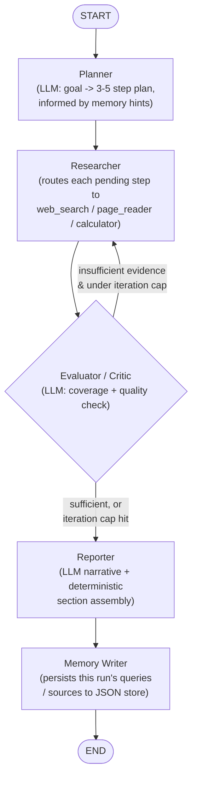

# ResearchPilot

An autonomous web research and report-generation agent, built as an AI Agentic
System contest submission. Give it a plain-language research question; it
plans its own research steps, uses real tools to gather evidence, critiques
its own findings, re-plans when the evidence is thin, and writes a structured
Markdown report — grounded only in what it actually found.

---
## 🎥 Demo Video

Watch the full 7 minute demo here:


[](https://youtu.be/jiIY8DXxz6I)

**Watch on YouTube:**  
https://youtu.be/jiIY8DXxz6I

The demo shows the full agentic workflow in action:
**Plan → Act → Observe → Critique → Re-plan → Report**

---

## Table of contents

1. [Problem statement](#problem-statement)
2. [Motivation](#motivation)
3. [Solution overview](#solution-overview)
4. [Architecture](#architecture)
5. [Agent workflow](#agent-workflow)
6. [Tools](#tools)
7. [State management](#state-management)
8. [Agentic loop](#agentic-loop)
9. [Memory / learning](#memory--learning)
10. [Evaluation](#evaluation)
11. [Project structure](#project-structure)
12. [Installation](#installation)
13. [Environment variables](#environment-variables-env)
14. [Running instructions](#running-instructions)
15. [Example input](#example-input)
16. [Example output](#example-output)
17. [Failure handling](#failure-handling)
18. [Limitations](#limitations)
19. [Future improvements](#future-improvements)
20. [Testing](#testing)

---

## Problem statement

Answering a non-trivial research question well — "what's the current pricing
for X, including its newest models?", "how does A compare to B on Y and Z?" —
usually means several rounds of searching, opening multiple pages, checking
whether what you found is actually current and consistent, and then writing
it up clearly with sources. Doing this by hand is slow and easy to do
sloppily: it's tempting to stop after the first plausible-looking answer
instead of verifying it.

## Motivation

The contest asks for a genuinely agentic system: something that plans a task,
uses an LLM to decide actions, calls real tools, keeps state across steps,
observes results, re-plans when necessary, and produces one coherent final
answer — not a single fixed prompt-and-response. ResearchPilot was chosen as
the project because autonomous research is a natural fit for exactly that
loop: a single search is rarely enough evidence, so the system has a real
reason to look at what it found, judge whether it's enough, and go back for
more when it isn't.

## Solution overview

ResearchPilot is a CLI agent, orchestrated as a [LangGraph](https://github.com/langchain-ai/langgraph)
state graph, that:

1. Takes a research question from the command line (or an interactive prompt).
2. **Plans** 3–5 concrete research steps with an LLM, informed by hints from
   related past runs (see [Memory](#memory--learning)).
3. **Researches** each pending step by routing it to the tool that fits it —
   web search, a specific page/PDF to read, or a calculation.
4. **Critiques** the evidence gathered so far with an LLM: is it enough to
   answer the question, and are there quality problems (unsupported claims,
   off-topic sources)? If not, it queues more research and loops back to
   step 3 — bounded by a hard iteration cap.
5. **Reports**: writes a structured, multi-section Markdown report,
   distinguishing facts from analysis, and never claiming research happened
   that didn't.
6. **Remembers**: saves this run's successful/failed queries and useful
   source domains to a small JSON store, so the next related run's planner
   starts with a head start.

Every stage prints a concise, human-readable trace line as it runs (no
hidden chain-of-thought), so the whole loop is visible and explainable while
it executes.

## Architecture



Five nodes, one shared `AgentState` object flowing through all of them, and
one conditional edge (`needs_more_research`, in `app/evaluator.py`) that
decides — based on current state, not a fixed script — whether to loop back
to research or move on to reporting. `app/graph.py` wires this exact graph
with LangGraph's `StateGraph`.

## Agent workflow

```
USER TASK
   |
   v
PLAN  ---------------------------->  Researcher picks 3-5 concrete steps
   |
   v
ACT (tool call)  ------------------> web_search / page_reader / calculator
   |
   v
OBSERVE  --------------------------> tool result recorded
   |
   v
STATE UPDATE  ----------------------> findings / sources / tool_history grow
   |
   v
CRITIC (evidence check)  ----------> sufficient? quality issues?
   |
   +--- No (insufficient, under cap) --> back to ACT with new steps
   |
   v
FINAL REPORT  ----------------------> structured Markdown, saved to output/
```

This is a real conditional loop, not a fixed sequence: the number of
research passes is decided by the critic's own judgment of the evidence
each time, bounded by `RESEARCHPILOT_MAX_ITERATIONS` (default `3`) so a
stubborn or ambiguous goal can never run forever.

## Tools

| Tool | File | Used for |
|---|---|---|
| `web_search` | `app/tools/web_search.py` | The default: a general research question. DuckDuckGo HTML endpoint, no API key needed. |
| `page_reader` | `app/tools/page_reader.py` | A step that names a specific URL — fetches the page and extracts its readable text, going deeper than a search snippet. Handles both HTML pages and PDF documents, detected by `Content-Type` header or `.pdf` URL suffix. |
| `calculator` | `app/tools/calculator.py` | A step that is, or asks for, an arithmetic calculation (e.g. `"Calculate: 49.99 * 12"`). Safe `ast`-based evaluation — never `eval`. |
| `report_writer` | `app/tools/report_writer.py` | Saves the finished report to `output/` with a timestamped filename. |

`app/tool_selector.py` decides which tool handles a given step, from the
step's shape — deliberately simple pattern matching, not a second LLM call
per step:

```
step contains a URL                         -> page_reader
step is/asks for an arithmetic calculation  -> calculator
otherwise (the common case)                 -> web_search
```

The *decision about what work is needed* (a new search? a specific source
read in depth? a calculation?) is already made by the LLM-driven evaluator;
tool selection only figures out *how to execute* the text it's given.

## State management

A single Pydantic model, `AgentState` (`app/state.py`), flows through every
node. Each node reads from it and returns a partial update — this is what
makes the pipeline explainable, loggable, and easy to test in isolation.

```python
class AgentState(BaseModel):
    user_goal: str

    # planning
    plan: List[str]
    current_step: int
    completed_steps: List[str]

    # research results
    findings: List[str]
    sources: List[Source]                # url, title, snippet
    missing_information: List[str]

    # bookkeeping
    tool_history: List[ToolCallRecord]   # tool, input, success, summary
    critique: Optional[Dict[str, Any]]   # sufficient, missing_information, issues, recommended_action
    iteration: int

    # output
    final_report: str
```

## Agentic loop

The loop is genuinely conditional, not a fixed sequence — the LLM decides
the next action based on state, per node:

- **Researcher** only processes steps not already in `completed_steps`, so
  the plan can grow between passes without redoing work.
- **Evaluator / Critic** (`app/evaluator.py`) reads `state.findings` and
  `state.sources`, asks an LLM whether that's enough evidence, and returns:
  - `sufficient: true/false`
  - `missing_information`: human-readable gaps (for the report's Limitations)
  - `additional_queries`: new steps to append to the plan (only used when
    `sufficient` is false) — never a query already planned or completed, and
    never a URL the LLM invented rather than copied from a known source
    (`_drop_hallucinated_urls`).
  - `issues` / `recommended_action`: quality flags (unsupported claims,
    off-topic sources), surfaced in the report regardless of coverage.
- **Router** (`needs_more_research`) sends the graph back to `researcher` if
  `missing_information` is non-empty *and* the iteration cap hasn't been
  hit; otherwise it moves on to `reporter`. Once `RESEARCHPILOT_MAX_ITERATIONS`
  is reached, the critic is not called again at all — the loop is bounded by
  a check, not by hoping the LLM eventually says "sufficient."
- If the critic's own LLM call fails or times out, the code never marks
  evidence sufficient just to move on — see [Failure handling](#failure-handling).

## Memory / learning

`app/memory.py` implements **previous experience → better planning/search
strategy**. This is explicitly *not* model training and *not* a vector
database — a single JSON file (`memory/agent_memory.json` by default, path
configurable via `RESEARCHPILOT_MEMORY_PATH`) holding one small record per
past run:

```json
{
  "timestamp": "2026-09-27T12:00:00+00:00",
  "goal": "What is the pricing for Acme Cloud?",
  "successful_queries": ["Acme Cloud pricing"],
  "failed_queries": ["Acme Cloud xyzzy nonsense"],
  "useful_domains": ["acme.com"],
  "iterations": 2,
  "sufficient": true
}
```

- **Writing** — the `memory_writer` graph node runs once per completed run,
  right after the report is generated. It splits `web_search` calls into
  `successful_queries` / `failed_queries` from `state.tool_history`, records
  de-duplicated source *domains* from `state.sources`, and appends the
  record to the store.
- **Retrieval** — before the planner's LLM call, `get_planning_hint`
  tokenizes the new goal and scores past runs by keyword overlap. The
  top few overlapping runs are rendered as a short "hints only, not facts"
  block appended to the planner prompt — the LLM is told to prefer
  phrasings that worked before and avoid ones that failed, but still plan
  from the *current* goal. No overlap means no hint block is added.
- **Failure handling** — a missing or corrupt memory file is treated as an
  empty store (logged, not raised); a fresh run is never blocked by it.

This intentionally does not do user-feedback storage, since nothing in the
current CLI collects feedback on a finished report — that part of a fuller
memory schema is left out rather than stubbed with fake data.

> **Note on updates:** the project zip does not include your real
> `memory/agent_memory.json` — it's local run history, not shipped code
> (see `.gitignore`). If you extract a new zip on top of this project,
> merge into your existing `memory/` folder rather than replacing it, or
> you'll lose accumulated run history (no error — it'll just look like a
> fresh, empty store).

## Evaluation

`app/evaluation.py` is a **separate, deterministic** evaluation layer for
*completed* runs — it does not replace or modify the in-loop critic. Run it
with:

```bash
python -m app.evaluate
```

It evaluates only observable artifacts (`user_goal`, `findings`, `sources`,
`iteration`, `missing_information`, `final_report`) against a fixed fixture
suite (`app/evaluation_data/phase7_cases.json`), with no LLM call by default.
Five 0.0–1.0 metrics, each a transparent deterministic check, not a claim of
objective truth:

| Metric | What it checks |
|---|---|
| **Relevance** | Fraction of meaningful task terms present in the final report (lexical, not semantic). |
| **Completeness** | Findings/sources/executive-summary/limitations present, no unresolved `missing_information`, terminated within the iteration limit. |
| **Source coverage** | Recall/precision between collected `state.sources` and URLs actually cited in the report. |
| **Grounding** | `Key Findings` bullets checked against gathered findings/source metadata via lexical overlap (≥ 0.50); weak matches are warned, not hard-failed. |
| **Format quality** | All seven required report sections present. |

`overall` is the unweighted mean of the five. Each run prints an
aggregate/per-case summary and saves full results to
`output/evaluations/evaluation_<timestamp>.json`.

**Actual output from this implementation's fixture suite** (4 cases:
simple factual, multi-entity comparison, a task needing additional
research, and intentionally limited evidence):

| Metric | Score |
|---|---:|
| Relevance | 1.0000 |
| Completeness | 0.9583 |
| Source coverage | 1.0000 |
| Grounding | 0.9167 |
| Format quality | 1.0000 |
| **Overall** | **0.9750** |

These are fixture-suite diagnostics, not a live-web benchmark or a claim
that the agent "scored 97.5% accurate" in any general sense.

## Project structure

```
research-pilot-main/
├── app/
│   ├── main.py             # CLI entrypoint: banners, --demo flag, saves report
│   ├── state.py             # shared Pydantic AgentState
│   ├── llm_provider.py      # configurable LLM wrapper (Anthropic / Groq)
│   ├── graph.py              # LangGraph wiring, incl. the conditional loop
│   ├── planner.py             # LLM planning node (+ memory hint)
│   ├── researcher.py           # routes each step to a tool; prints [STATE]
│   ├── tool_selector.py         # decides web_search / page_reader / calculator
│   ├── evaluator.py              # in-loop coverage + quality critic / router
│   ├── evaluation.py              # deterministic completed-run metrics
│   ├── evaluate.py                 # `python -m app.evaluate` suite CLI
│   ├── evaluation_data/
│   │   └── phase7_cases.json        # fixed evaluation fixtures
│   ├── reporter.py                   # structured multi-section report
│   ├── memory.py                      # JSON-backed run history + retrieval
│   ├── guardrails.py                   # input + outbound-URL validation
│   └── tools/
│       ├── web_search.py
│       ├── page_reader.py
│       ├── calculator.py
│       └── report_writer.py
├── tests/                                # 122 tests, see "Testing" below
├── output/                                # generated reports land here
│   └── evaluations/                        # timestamped evaluation JSON
├── memory/                                  # agent_memory.json lands here
├── .env.example
├── requirements.txt
└── README.md
```

## Installation

```bash
cd research-pilot-main
python3 -m venv venv
source venv/bin/activate        # Windows: venv\Scripts\activate
pip install -r requirements.txt
cp .env.example .env
# edit .env and set GROQ_API_KEY=... (default provider) or ANTHROPIC_API_KEY=sk-ant-...
```

## Environment variables (`.env`)

| Variable | Purpose |
|---|---|
| `LLM_PROVIDER` | Which LLM backend to use: `groq` (default) or `anthropic`. |
| `LLM_MODEL` | Model name passed to the provider SDK, e.g. `openai/gpt-oss-120b` (Groq) or `claude-sonnet-4-6` (Anthropic). |
| `LLM_TIMEOUT_SECONDS` | Max duration for one provider request before it fails cleanly (default `60`). |
| `GROQ_API_KEY` | Your Groq API key. Required when `LLM_PROVIDER=groq`. Never commit this. |
| `GROQ_REQUESTS_PER_MINUTE` | Client-side throttle for Groq calls (default `25`). |
| `GROQ_REASONING_EFFORT` | `low`/`medium`/`high` reasoning budget for GPT-OSS models only (default `low`). |
| `ANTHROPIC_API_KEY` | Your Anthropic API key. Only required when `LLM_PROVIDER=anthropic`. |
| `RESEARCHPILOT_MAX_ITERATIONS` | Max research/critic loop iterations before forcing a report (default `3`). |
| `RESEARCHPILOT_MEMORY_PATH` | Path to the JSON memory store (default `memory/agent_memory.json`). |
| `RESEARCHPILOT_EVALUATOR_TIMEOUT_SECONDS` | Critic wall-clock ceiling (default `45`). |
| `RESEARCHPILOT_EVALUATOR_MAX_TOKENS` | Max critic JSON generation budget (default `900`). |
| `RESEARCHPILOT_REPORTER_TIMEOUT_SECONDS` | Final report LLM wall-clock ceiling (default `45`). |
| `RESEARCHPILOT_REPORTER_MAX_TOKENS` | Max tokens requested for final narrative synthesis (default `1000`). |

## Running instructions

```bash
# Ask a specific question
python -m app.main "What are the key differences between PostgreSQL and MySQL for a high-write OLTP workload?"

# Interactive prompt (no args)
python -m app.main

# Demo mode: runs a built-in comparison question with extra banners,
# so the full PLAN -> ACT -> OBSERVE -> STATE -> CRITIC -> REPORT trace
# is easy to follow end to end
python -m app.main --demo

# Deterministic evaluation suite over completed-run fixtures
python -m app.evaluate

# Full test suite
python -m pytest tests/ -v
```

Terminal output is a live, human-readable trace of every stage (`[PLAN]`,
`[TOOL]`, `[OBSERVE]`, `[STATE]`, `[CRITIC]`, `[DECISION]`, `[REPORT]`,
`[MEMORY]`); the finished report is also saved as a timestamped Markdown
file under `output/`.

## Example input

```bash
python -m app.main "What is the capital of France?"
```

## Example output

Terminal trace (abbreviated):

```
======================================================================
USER TASK
What is the capital of France?
======================================================================
[MEMORY] No related past runs found.
[PLAN] Created 3 research step(s): ["Search for 'capital of France'", ...]
[TOOL] web_search
[RESEARCH] Searching: Search for 'capital of France'
[OBSERVE] 3 result(s) found
...
[STATE] findings=3 sources=9 completed_steps=3/3
[CRITIC] Evaluating evidence (iteration 1/3)...
[CRITIC] Evidence sufficient — continuing to report.
[REPORT] Generating final report (max 45s; fallback enabled)...
[MEMORY] Saved this run's queries/sources for future planning.

======================================================================
FINAL REPORT
======================================================================
# Research Report

## Executive Summary
The capital of France is Paris.
...
## Sources
- Paris - Wikipedia (https://en.wikipedia.org/wiki/Paris)
- France | History, Maps, Flag, Population, Cities, Capital, & Facts ... (https://www.britannica.com/place/France)
...

[TOOL] report_writer
[SAVED] output/report_20260927_174032.md

======================================================================
SUMMARY: 3 step(s) planned, 3 completed, 9 source(s) gathered, 1 research iteration(s)
======================================================================
```

For a question that genuinely needs more than one pass — e.g.
`python -m app.main --demo` ("Compare the pricing and context window size of
the latest Claude and GPT models") — the same run visibly loops: the critic
flags specific missing numbers, queues new `page_reader` steps against exact
URLs already found, and only proceeds to the report once it confirms
sufficiency (or the iteration cap is reached). If the evidence genuinely
never firms up, the Executive Summary says so explicitly rather than
guessing — this is the grounding gate working as intended, not a failure.

## Failure handling

| Failure mode | How it's handled |
|---|---|
| Empty / malformed / oversized task input | `guardrails.validate_task`, checked before any LLM/tool call |
| Outbound URL is unsafe (SSRF-shaped) | `guardrails.validate_fetch_url` blocks non-http(s) schemes, missing hosts, and loopback/private/link-local/known-local hostnames before `page_reader` ever makes a request |
| API failure / provider timeout | `app/llm_provider.py` (`LLMError`, hard timeout, Groq rate-limit retry with `retry-after`) |
| Search / page-read failure | Per-tool `try/except` in `app/researcher.py`, turned into a findings note instead of a crash |
| Malformed LLM JSON (plan or critique) | Bounded extraction + one retry (`_extract_json_array` / `_extract_json_object`) |
| Invalid calculator input | `ast`-based evaluator, raises `CalculatorError` — never `eval` |
| Maximum iterations reached | Enforced in `app/evaluator.py` before any further LLM call — the loop cannot run forever |
| Critic times out or fails | First timeout triggers one bounded deeper-source recovery pass; if still unconfirmed, research stops and evidence sufficiency is explicitly recorded as unconfirmed — never silently marked sufficient |
| Missing sources / unsupported claims | Reporter's grounding gate skips LLM narrative synthesis when the critic didn't confirm sufficiency, and emits a deterministic evidence-only report instead |
| Empty/failed report synthesis | Deterministic fallback narrative preserves gathered evidence rather than inventing conclusions |
| Corrupt/missing memory file | Treated as an empty store (logged, not raised) — never blocks a run |
| Empty final report (defensive net) | `app/main.py` refuses to save/print a blank report; should be unreachable given the fallbacks above, but guarded anyway |

## Limitations

- `validate_fetch_url` blocks known-local hostnames and literal private/
  loopback/link-local IPs, but does not resolve hostnames via DNS — so it
  does not defend against DNS rebinding.
- Task input validation is deterministic length/shape checks, not an
  LLM-based "is this a sensible research question" classifier.
- The critic's quality `issues` (unsupported claims, off-topic sources) are
  surfaced in the report's Limitations, but don't independently trigger a
  new research pass beyond what the coverage check already drives.
- Web search uses a no-key DuckDuckGo HTML scrape — fine for this stage,
  more fragile than a paid search API.
- `page_reader` does simple `<p>` extraction for HTML (no JS rendering) and
  page-by-page text extraction for PDFs via `pypdf` (no OCR) — it won't get
  useful text from a heavily JS-rendered page or a scanned/image-only PDF.
- Memory retrieval is plain keyword overlap on goal text, not semantic
  similarity — no embeddings/vector store.
- Memory only records `web_search` queries as successful/failed;
  `page_reader`/`calculator` calls aren't stored as search patterns.
- No user-feedback storage on finished reports.
- The memory store is a single flat JSON file with no size cap or pruning —
  fine at prototype/contest scale, will grow unbounded over many real runs.
- `app/evaluate`'s benchmark uses fixed completed-run fixtures, not live
  research — useful for regression/transparency, not a measure of current
  web-search quality.
- Relevance and grounding are lexical heuristics, not semantic/factual
  verification; the four-case fixture dataset is small and representative,
  not a statistically meaningful benchmark.
- CLI only — no web UI, no persistent database beyond the JSON memory file,
  no multi-agent parallelism, single LLM provider per run (no automatic
  cross-provider fallback).

## Future improvements

- Optional semantic memory retrieval (embeddings) as an alternative to
  keyword overlap, for goals phrased very differently from past ones.
- A live-web evaluation harness (real search + real critic) as a
  supplementary signal alongside the current deterministic fixture suite.
- Additional tools: a structured API connector (rather than only web
  search/page reading), and OCR for scanned/image-only PDFs.
- A lightweight web UI or dashboard over the same graph, so a run can be
  watched/replayed without a terminal.
- Parallel execution of independent research steps within one pass,
  instead of processing the plan sequentially.
- Automatic fallback across LLM providers if the configured one is down,
  rather than a single configured provider per run.
- Bounded pruning/rotation for the memory store once it grows large.
- A critic that can re-route research specifically to resolve a flagged
  quality issue (e.g. re-verify an unsupported claim), not only a coverage
  gap.

## Testing

```bash
pip install pytest
python -m pytest tests/ -v
```

**122 tests**, covering every phase of development: `AgentState`, all four
tools (`calculator`, `page_reader`, `report_writer`, and `web_search`
indirectly via the researcher), JSON-extraction and routing decisions in
the planner/evaluator, `tool_selector.choose_tool` for every step shape,
`generate_report`'s section parsing/assembly and fallback paths,
`app/memory.py`'s load/save/corrupt-file handling and keyword-overlap
retrieval, the Phase 7 evaluation module's metric checks, Phase 8's input
and outbound-URL guardrails, Phase 10's `--demo` flag and `[STATE]`
logging — and two full **end-to-end tests** (`tests/test_end_to_end.py`)
that build and invoke the actual compiled LangGraph graph (not a mocked
node in isolation), driving a genuine two-pass research loop and verifying
the iteration cap actually bounds it.

All of this runs without network access or a real API key — every
network/LLM call is monkeypatched out; only pure filesystem operations
(`write_report`, the memory store) touch a real (temporary) disk. Live LLM
calls and live web search are *not* covered by the automated suite, since
they need real credentials and internet access — verify those manually
with `python -m app.main "..."` or `python -m app.main --demo`.
